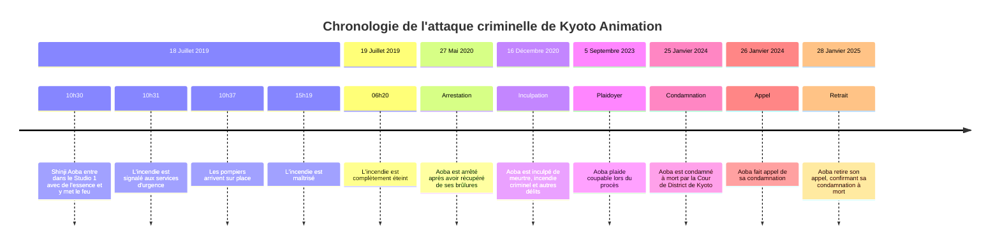

## Chronologie des Événements

```mermaid!
timeline
    title Chronologie de l'attaque criminelle de Kyoto Animation
    section 18 Juillet 2019
        10h30 : Shinji Aoba entre dans le Studio 1 avec de l'essence et y met le feu
        10h31 : L'incendie est signalé aux services d'urgence
        10h37 : Les pompiers arrivent sur place
        15h19 : L'incendie est maîtrisé
    section 19 Juillet 2019
        06h20 : L'incendie est complètement éteint
    section 27 Mai 2020
        Arrestation : Aoba est arrêté après avoir récupéré de ses brûlures
    section 16 Décembre 2020
        Inculpation : Aoba est inculpé de meurtre, incendie criminel et autres délits
    section 5 Septembre 2023
        Plaidoyer : Aoba plaide coupable lors du procès
    section 25 Janvier 2024
        Condamnation : Aoba est condamné à mort par la Cour de District de Kyoto
    section 26 Janvier 2024
        Appel : Aoba fait appel de sa condamnation
    section 28 Janvier 2025
        Retrait : Aoba retire son appel, confirmant sa condamnation à mort
```